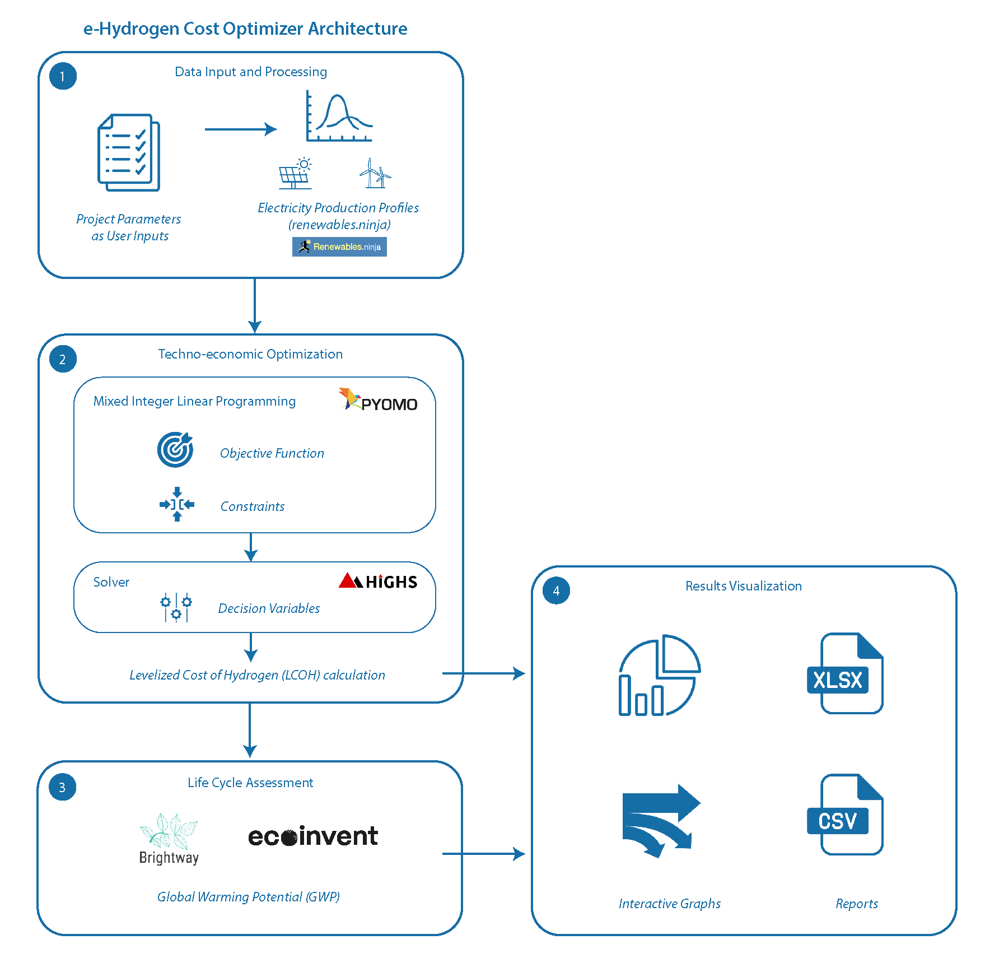

# Summary

The global transition toward low-carbon energy systems increasingly relies on hydrogen production from renewable sources such as solar and wind [@VAZQUEZSANCHEZ2025792]. Designing and operating these systems involves balancing economic, technical, and environmental factors, from resource availability and system sizing to storage integration and life-cycle emissions.  

To address these complexities, *e-Hydrogen Cost Optimizer* was developed as a Python-based application that supports techno-economic optimization and environmental assessment of electrolytic hydrogen (e-hydrogen) systems.  

The tool applies a mixed-integer linear programming (MILP) model adapted and modified from [@FLOREZ2024959] to determine the optimal configuration and operation of solar photovoltaics, wind turbines, batteries, hydrogen storage, and electrolyzers to minimize the Levelized Cost of Hydrogen (LCOH) for any region of interest worldwide. The electricity production profiles for solar and wind systems are obtained from the *renewables.ninja* platform [@PFENNINGER20161251] [@STAFFELL20161224], ensuring realistic and location-specific renewable generation data. It uses the Pyomo framework [@bynum2021pyomo] [@hart2011pyomo] for mathematical optimization and relies on HiGHS solver [@Huangfu2018-cq] to get a solution. It also integrates life cycle assessment (LCA) capabilities through Brightway25 [@Mutel2017], enabling simultaneous evaluation of both cost and environmental performance. \autoref{fig:fig1} shows the main architecture. 

With its modular Python-based code and intuitive interface, the software promotes transparent, reproducible research and facilitates both educational and professional use in e-hydrogen system design. It empowers users to explore the interplay between cost, efficiency, and environmental impact within a unified open-source framework. The goal is to further develop and maintain this tool by incorporating hydrogen derivatives analysis such as ammonia and e-methanol production. 

# Statement of need

The decarbonization of energy systems requires analytical tools capable of capturing both the techno-economic dynamics and environmental impacts of renewable hydrogen production. Existing studies often treat optimization and life-cycle assessment as separate tasks, which limits the comparability and comprehensiveness of results. Moreover, few open-source tools exist that integrate these aspects within a consistent, adaptable, and transparent platform.  

*e-Hydrogen Cost Optimizer* addresses this gap by providing an accessible, open-source Python platform for integrated techno-economic optimization and environmental assessment of e-hydrogen systems. This integration supports more informed decision-making in the design and policy evaluation of e-hydrogen infrastructure.

# Target Audience

This software is intended for researchers, engineers, educators, and students engaged in e-hydrogen production, energy systems analysis, or sustainability assessment. It is especially suited for users seeking a transparent, reproducible, and flexible framework for evaluating hydrogen production systems across diverse geographical, technological, and market contexts.

# Acknowledgements

This software is based on research supported by the NEOM Education, Research, and Innovation Foundation under agreement number F01-001-2023-17. The authors thank the Clean Energy Research Platform (CERP) and the Center of Excellence for Renewable Energy and Storage Technologies (CREST), both part of King Abdullah University of Science and Technology (KAUST), Saudi Arabia, for providing funding and support. 

# References